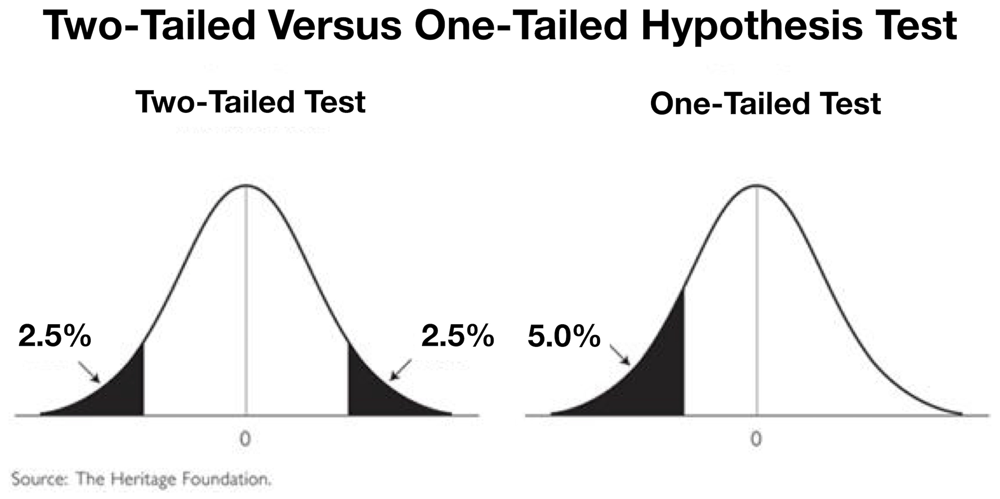

<style>
body {
    font-family: "Cabin", sans-serif;
}
p {
    font-family: "Cabin", sans-serif;
}
</style>

<a href="mailto:coyner@ohsu.edu"><i class="fa fa-envelope fa-fw"></i>&nbsp; coyner@ohsu.edu</a><br>

# Overview
This tutorial provides an introduction to confidence intervals. Specifically, we will learn how to obtain confidence intervals for a population mean in R. Data sets and Rmarkdown files are available at: https://github.com/coyneras/biostats-tutorials


## Acknowledgements
This tutorial was adapted from [Amber Lin](https://ohsu-psu-sph.org/faculty-directory/name/amber-lin/)'s tutorials for PHPM 524: Introduction to Biostatistics at Oregon Health & Science University.

The template used for this tutorial is from
[Alison Presmanes-Hill](https://github.com/apreshill/data-vis-jamboree-ggplot)


```{r setup, include = FALSE}
knitr::opts_chunk$set(error = TRUE, comment = NA, warning = FALSE, message = FALSE, tidy = FALSE, fig.path="figs/", echo = TRUE)
```


# Setup

## Install Packages 

Do this once per machine.

```{r install_packages_demo, eval=FALSE}
install.packages('readr')
install.packages('tidyverse')
install.packages('skimr')
install.packages('Publish')
```

## Load Packages 

Do this once per R session.

```{r load_packages_demo}
library(readr)
library(tidyverse)
library(skimr)
library(Publish)
```

## Import Data 

- Copy `bone_density.csv` to an easily accessible location
- Use `read_csv()` from the `readr` package to import the csv
- The argument supplied to `read_csv()` is the url or path to the dataset
- Finally, assign the data to an R object using `<-` and call that object something simple like `bone`

```{r}
bone <- read_csv('data/bone_density.csv')
```


# Initial Data Analysis

## Base R

Use the `head()` function in your console to briefly check the structure of the data set.

```{r head}
head(bone)
```

As you can see, `head()` cannot display all of our variables! So we need to use some tools that are designed for larger data sets and that are a bit more descriptive...

## tidyverse + skimr

Glimpse essentially just provides us with a better view of our data than `head()`.
```{r}
glimpse(bone)
```

However, `skim()` computes summary statistics for us, as well. For instance, we get the mean, standard deviation, and quartiles for each variable. It even plots mini histograms for us!
```{r}
skim(bone)
```

# Visualization

Now that we've reviewed some summary statistics, the next step is to visualize our data. This will give us a better idea of the spread of the data for our variables of interest.


## Boxplots

We can also look at a boxplot of the age distribution by twin type. To do so, we'll use `ggplot()`. There are a few things going on in this command, so we'll run through them one by one just to refresh your memory. First, we are calling `ggplot()` to tell R we'd like to create a plot. Next, we tell `ggplot()` which data set we'd like to use by supplying it as the first argument. Then we specify what `x` and `y` variables from the data set we'd like to use using the `aes()` (aesthetics) command. If we stop here, `ggplot` will know what data set we want to use and what variables we wish to model, but it won't know how we want them displayed and we'll just get an empty plot:
```{r}
ggplot(bone, aes(x = zyg, y = age))
```

So, we tell `ggplot()` that we'd like to use the specified variables from the specified data set to make a boxplot by adding `+ geom_boxplot()` after our call to `ggplot()`.
```{r}
ggplot(bone, aes(x = zyg, y = age)) + 
  geom_boxplot()
```

Great! But this plot is a bit...bland. Let's take advantage of `ggplot()` and make it more aesthetically pleasing!
```{r}
ggplot(bone, aes(x = zyg, y = age, fill = zyg)) + 
  geom_boxplot() +
  ggtitle("Boxplot of Age by Twin Type") +
  xlab('Zygote Status') +
  ylab('Age')
```


## Confidence Intervals

Again, we supply our basic arguments to `ggplot()`. Using the `stat_summary()` argument, we tell `ggplot()` that we'd like to compute both the mean and confidence interval for each group. In the first `stat_summary()` argument, we ask `ggplot()` to compute the 95% confidence interval using the `mean_cl_normal` function and represent it as error bars. We use the `fun.data` argument (rather than `fun.y`) because we wish to return a set of numbers (the high and low of each interval) rather than a single number (such as the mean).
```{r fig.align="center"}
ggplot(data = bone, aes(x = zyg, y = age)) +
  stat_summary(geom = "errorbar",
               fun.data = mean_cl_normal)
```

Now we add a second `stat_summary()` argument and specify that we'd like to 
compute and represent the mean of each group as a red point on our chart.
```{r fig.align="center"}
ggplot(data = bone, aes(x = zyg, y = age)) +
  stat_summary(geom = "errorbar",
               fun.data = mean_cl_normal) +
  stat_summary(geom = "point",
               fun.y = mean,
               color = "red",
               size = 6)
```

`mean_cl_normal` computes a 95% confidence interval by default. If we want to calculate the 99% confidence interval, we make use of the `fun.args` parameter. This allows us to pass additional arguments to the function we've called, in the form of a list. Below, we compute the 99% confidence interval:
```{r fig.align="center"}
ggplot(data = bone, aes(x = zyg, y = age)) +
  stat_summary(geom = "errorbar",
               fun.data = mean_cl_normal,
               fun.args=list(conf.int=0.99)) +
  stat_summary(geom = "point",
               fun.y = mean,
               color = "red",
               size = 6)
```
 

# Confidence Intervals

<center>

</center>

When we compute two-sided confidence intervals, we are computing the area between the two tails of the distribution. When we compute one-sided confidence intervals, we are computing the area from one tail up to (but not including) another tail. So, a one-sided 95% confidence interval includes more of the tail than a two-sided 95% confidence interval.


## Two-sided

### For a Variable

Let's compute 95% and 99% confidence intervals for the mean population age (`bone$age`). We'll use the `ci.mean()` command from `Publish`. By default, this command produces a 95% confidence interval.
```{r}
ci.mean(bone$age)
```

Now, let's compute the 99% confidence interval. Remember that $\alpha$ is our significance level (i.e. the probability of incorrectly rejecting the null hypothesis). To obtain a 99% confidence interval, we simply set $\alpha = 0.01$, since $1 - confidence~level = \alpha$.
```{r}
ci.mean(bone$age, alpha = 0.01)
```


### For Groups within a Variable

Let's compute a 95% confidence interval of the mean population age for fraternal and identical twins, denoted by the `zyg` variable. Remember, the `~` is R's way of saying "by"" (i.e. "compute this by this"). So here, we compute `age` by `zyg`. Because we've only supplied R with the variables of interest, but haven't supplied the actual data set, we do so using the `data` argument.
```{r}
ci.mean(age ~ zyg, data = bone)
```

Theoretically, we could compute confidence intervals for age based on twin status and any other number of predictors. For example:
```{r}
ci.mean(age ~ zyg + men1, data = bone)
```


## One-sided

When we use z- or t-critical values for a one-sided 95% confidence limit, the critical values that we use are a bit different. In this instance, we are putting all 5% of the area into the lower or upper tail of the distribution depending on whether we want to calculate a one-sided lower bound or upper bound limit. For a 2-sided 95% confidence interval, we split up the area and put 2.5% in the lower and upper tails of the distribution. Refer to the image above to help visualize this idea.

Therefore, to calculate a one-sided 95% confidence bound (lower or upper), we use the z- or t-critical value for a 2-sided 90% confidence limit. Let’s say that we want to calculate a one-sided 95% upper confidence bound of age by twin type (fraternal or identical).
```{r}
ci.mean(age ~ zyg, data = bone, alpha = 0.10)
```

Here, we are only interested in the upper confidence bounds.  We can interpret this output as – “Average age of the identical twins is approximately 51 years and we are 95% confident that it is, at most, 55 years”.  Similarly, we can interpret the mean age of fraternal twins as – “Average age of the fraternal twins is approximately 46 years and we are 95% confident that it is, at most, 51 years.”

